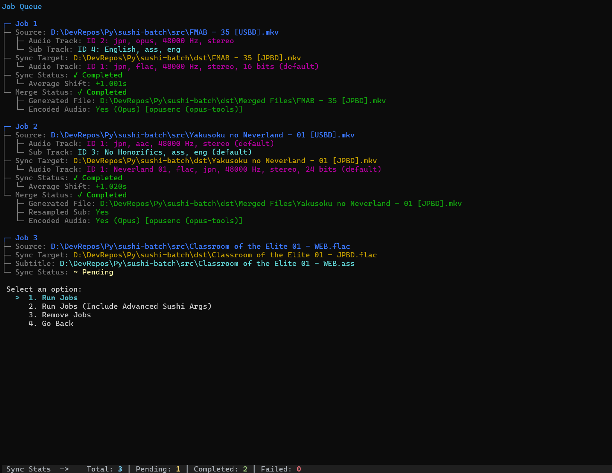

# Sushi Batch
Batch subtitle synchronization tool based on [Sushi](https://github.com/C1fer/sushi-next).




## Overview
This tool allows you to sync subtitle timing between different releases of the same media (e.g., WEB-DL to Blu-Ray) without manual adjustments. It is ideal for anime fansub releases and translations from different sources, but can be used for any media with existing subtitles.
### Main Features
- Batch processing of subtitle synchronization tasks using Sushi.
- Merge the synced subtitle back into the target video after syncing (requires MKVMerge). [More info](#merge-synced-subs-with-video)
- Re-encode lossless audio tracks (e.g., FLAC, WAV) in the video before merging.
  - Supports **AAC**, **EAC-3** and **Opus**.
  - A recommended bitrate is selected based on the number of audio channels (can be customized in [Encode Settings](Settings.md)).
- Resample subtitle resolution to match the target video before merging (requires Aegisub-CLI).

## How does Sushi work?
Sushi works by finding the closest similar pattern between a provided source and sync target audio track. The obtained shift value is applied to the output subtitle, which will be synced to the sync target track.

### Audio-based Sync
You must provide:
- A subtitle file (ASS, SRT, SSA).
- The original audio track for that subtitle.
- A sync target audio track to sync the subtitle to.

### Video-based Sync
You only need to provide:
- A source video file that contains subtitle and audio tracks.
- A sync target video file. 

You must select the reference subtitle and audio track from the source file, and the target audio track for the sync. FFmpeg will take care of extracting these tracks for later processing. 

The newly synced subtitle file can be found in the same directory as the target file, with the `.sushi` suffix.

## Installation
`pip install sushi-batch`

### Required apps
* [FFmpeg / FFprobe](https://ffmpeg.org/download.html)
* [MKVMerge (from MKVToolNix)](https://mkvtoolnix.download/downloads.html) (Optional)
* [Aegisub-CLI](https://github.com/Myaamori/aegisub-cli) (Optional)
* [Opusenc](https://www.videohelp.com/software/OpusTools) (Optional)
  
### Windows
Add the required binaries to PATH or install them via a package manager like [Chocolatey](https://chocolatey.org/). You can also copy the executables to the directory from which you run this app (not recommended).

### Linux
Most distros link installed packages to PATH automatically, so just make sure to install the required apps via your distribution's package manager.

### macOS
```
brew install ffmpeg mkvtoolnix
```

## Folder Structure for Directory Select Modes
### Audio-Sync
<pre>
  <code>
    📂Source Folder
     ┣ 🔊Fullmetal Alchemist - 01 (DVD).flac
     ┣ 📜Fullmetal Alchemist - 01 (DVD).ass
     ┣ 🔊Fullmetal Alchemist - 02 (DVD).flac
     ┣ 📜Fullmetal Alchemist - 02 (DVD).ass
     ┣ 🔊Fullmetal Alchemist - 03 (DVD).flac
     ┗ 📜Fullmetal Alchemist - 03 (DVD).ass
    📂Sync Target Folder
     ┣ 🔊Fullmetal Alchemist - 01 (BD).flac
     ┣ 🔊Fullmetal Alchemist - 02 (BD).flac
     ┗ 🔊Fullmetal Alchemist - 03 (BD).flac
  </code>
</pre>

### Video-Sync
<pre>
  <code>
    📂Source Folder
     ┣ 📺Fullmetal Alchemist - 01 (DVD).mkv
     ┣ 📺Fullmetal Alchemist - 02 (DVD).mkv
     ┗ 📺Fullmetal Alchemist - 03 (DVD).mkv
    📂Sync Target Folder
     ┣ 📺Fullmetal Alchemist - 01 (BD).flac
     ┣ 📺Fullmetal Alchemist - 02 (BD).mkv
     ┗ 📺Fullmetal Alchemist - 03 (BD).mkv
  </code>
</pre>

## Important
Data and logs for all enabled operations are stored in the **SushiBatchTool** directory inside your Documents folder:
- Windows: `C:\Users\<your-user>\Documents\SushiBatchTool`
- Linux: `/home/<your-user>/Documents/SushiBatchTool`
- macOS: `/Users/<your-user>/Documents/SushiBatchTool`


## Merge synced subs with video
If mkvmerge is installed, synced subtitles can be merged into the selected sync target video file.

Video merging supports two workflows:
* Automatic merge after sync completion.
* Manual merge from the *Job Queue* menu.

The following behavior can be adjusted in the *App Settings* menu:
* Merge automatically on sync completion.
* Re-encode lossless audio before merge. 
* Target lossy codec for encoding.
* Bitrates
* Resample synced subtitles before merge (Aegisub-CLI required).
* Delete generated subtitle files after successful merge.
* Choose which tracks/metadata are copied from source and sync target files.
* Set default/forced flags and a custom track name for the merged subtitle.
* Save MKVMerge logs to the app data folder.